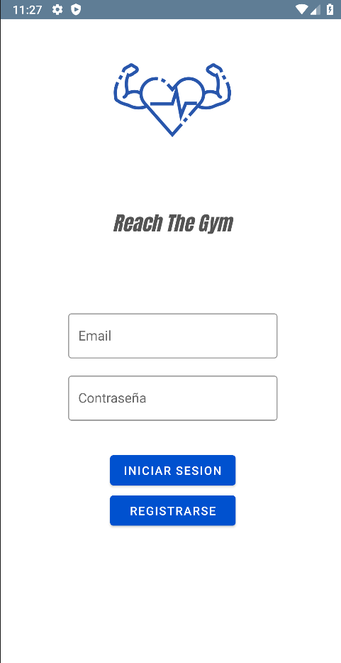
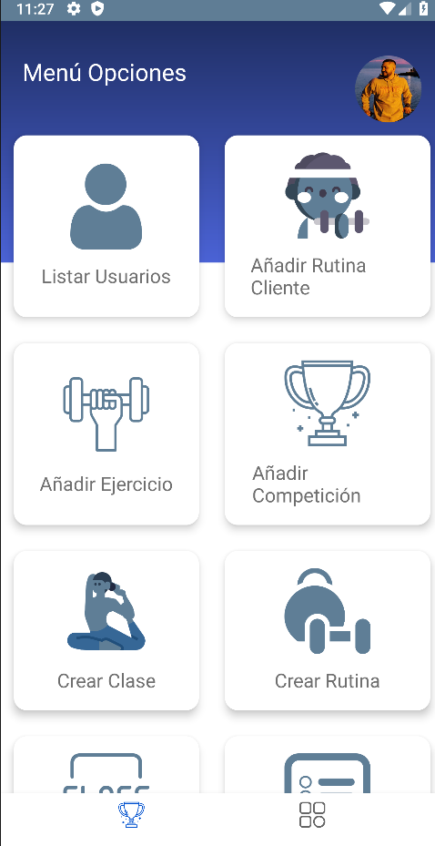
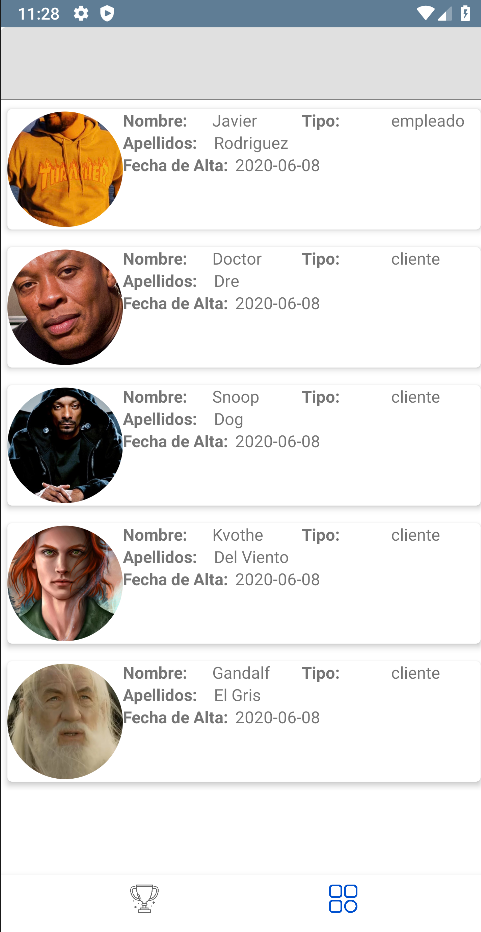
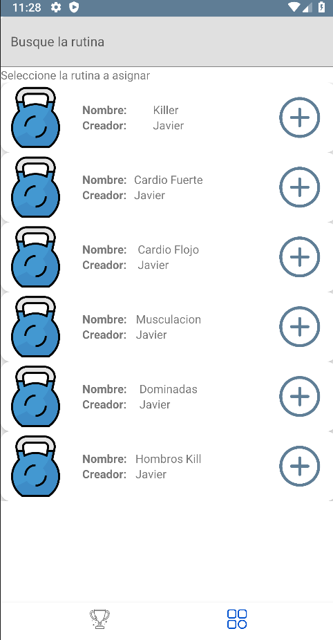
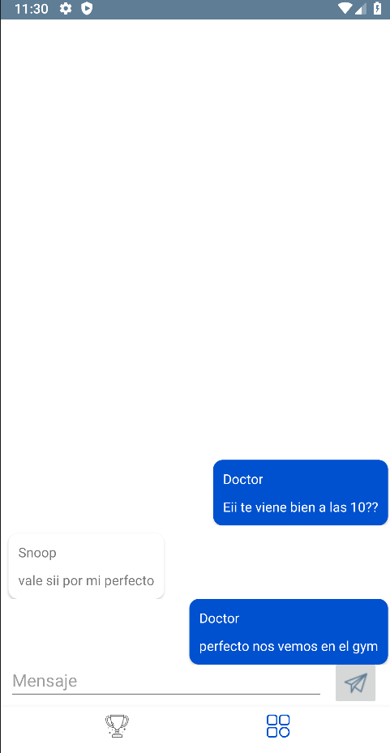
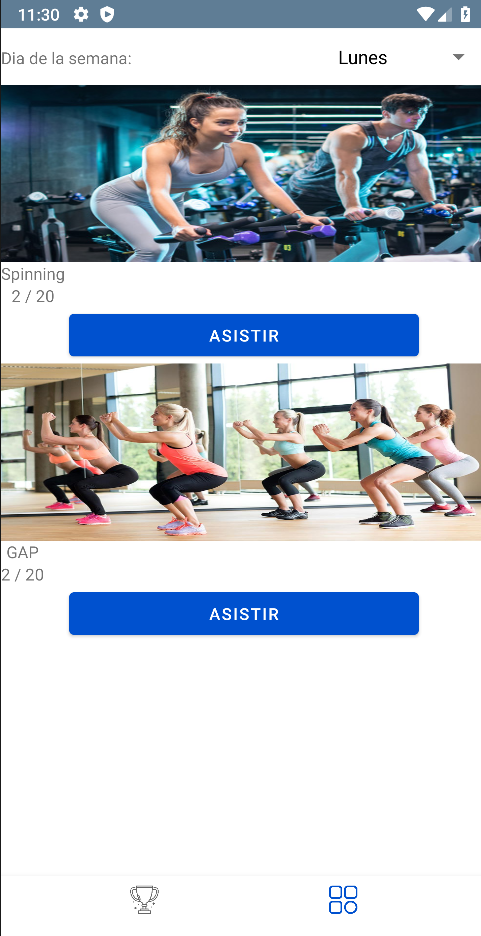

# Reach The GYM

>La app para tu centro deportivo.

---

### Tabla de contenidos

-[Descripción](#descripción)
-[Tecnologías](#tecnologías)
-[Imagenes](#imágenes)
-[Como Usarla](#como-usarla)

---

## Descripción

Es una aplicación pensada pasa un entorno fitness, ya sea un gimnasio, un box (donde se
practican varias disciplinas incluyendo el CrossFit) o cualquier centro de rendimiento
deportivo.
La principal función de la aplicación será la de tener bien organizada la estructura
deportiva del centro , en ella incluimos las clases que se impartas, las competiciones que
tengan en el gimnasio,y se podrá mantener a los usuarios que quieran buscar a un
compañero de entrenamiento en contacto con otros para así generar un buen ambiente
en el gimnasio.

### Tecnologías

-Firebase
-Java
-Android Studio
-Material Design 
-Genymotion
-Gradle

## Imágenes

## Como usarla

Empleado

El usuario empleado en el fragment principal , puede listar los usuarios de la aplicación y
mediante un click puede acceder a ver su perfil y cambiarle el tipo de usuario.
Puede añadir rutina al cliente mediente la opción AñadirRutinaCLiente la cual primero
muestra los clientes y mediante un click puede acceder a donde estén las rutinas para
añadirselas.
Añadir ejercicio añade un ejercicio que necesita 4 fotos.
Añadir competición, añade las competiciones al centro.
Crear clase puede crear una clase poniendo dia de la semana y la hora de comienzo y
finalizacion.
Crear rutina lista los ejercicios y puedes ponerle un nombre a ella.
Listar las clases que hay en el centro.
Listar anuncios de clientes que quieren rutinas personalizadas y poder añadirselas
mediante el botón añadir.
Listar las competiciones del centro y borrarlas.
Mediante la foto del menú puede acceder a su perfil.

Clientes

Pueden ver las rutinas que tienen asignadas en mis rutinas.
En buscar compañero puede insertar un anuncio para buscar los compañeros.
Anuncio compañero lista los anuncios que han puesto los demás usuarios y mediante
botones puede acceder al chat y a borrarlo si es suyo.
Pedir rutina personalizada.
Ver las competiciones y apuntarse a ella así como ver sus rankings.
Listar las clases que hay en el centro y apuntarse a ellas.

---

